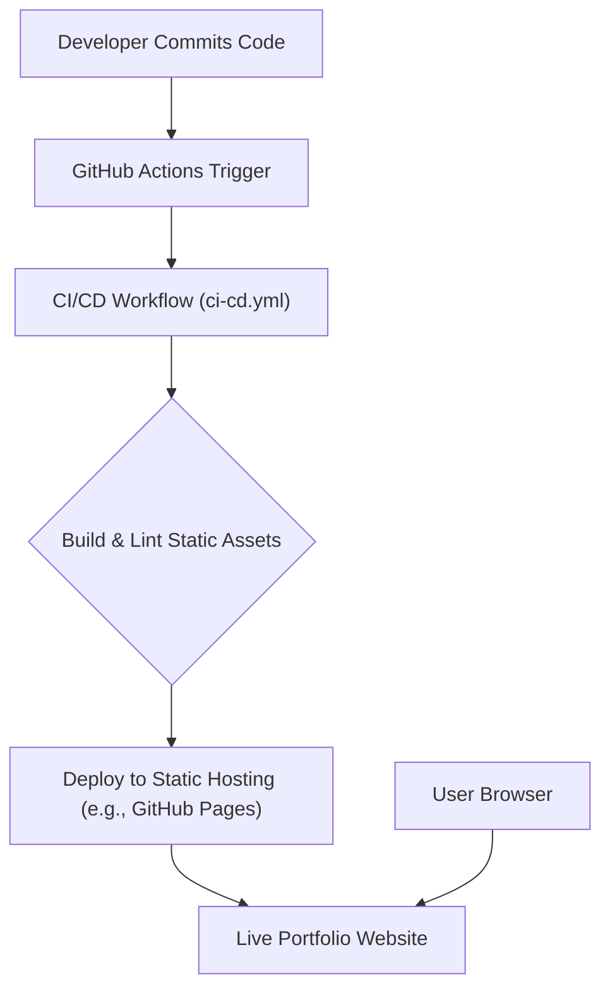

# 🚀 Dynamic Portfolio Website

<p align="center"></p>

## Short Description
This repository hosts a meticulously crafted and visually engaging personal portfolio website, designed to showcase an individual's skills, experience, and projects. Built with modern web technologies, it offers a responsive, interactive, and professional platform for developers, designers, or any professional seeking to highlight their work and journey to the world.

## ✨ Key Features
*   **Interactive & Responsive Design:** A fluid and engaging user experience across all devices, from desktops to mobile phones, ensuring accessibility and visual appeal.
*   **Comprehensive Project Showcase:** Dedicated sections to highlight diverse projects with detailed descriptions, demonstrating capabilities and technical prowess.
*   **Dynamic Experience Timeline:** A clear, chronological presentation of professional and academic journey, offering insights into growth and accomplishments.
*   **Skill Matrix Visualization:** An organized display of technical and soft skills, providing a quick overview of competencies.
*   **Integrated Resume Download:** Easy access to a downloadable resume (PDF), facilitating seamless application processes.
*   **Modern Web Technologies:** Leverages HTML5, CSS3, and JavaScript for a robust, performant, and maintainable frontend.
*   **Automated CI/CD Workflow:** Ensures code quality and streamlined deployments with GitHub Actions, making updates effortless and reliable.
*   **Dedicated 404 Page:** Custom error page for a polished user experience even on broken links.

## Who is this for?
This portfolio website is ideal for:
*   **Software Developers & Engineers:** To present their coding projects, technical skills, and professional journey.
*   **UX/UI Designers:** To showcase their design portfolios and creative work.
*   **Freelancers & Consultants:** To attract potential clients by demonstrating past successes and capabilities.
*   **Students & Graduates:** To create a compelling online presence for job applications and academic pursuits.
*   Anyone seeking a professional, customizable, and high-impact personal website.

## Technology Stack & Architecture
This project is built primarily as a static site, emphasizing frontend performance and ease of deployment.

**Frontend:**
*   **HTML5:** The core structure of all web pages.
*   **CSS3:** For styling, including responsive design elements (`assests/css/style.css`, `404.css`).
*   **JavaScript (ES6+):** Powers interactive elements, dynamic content loading, and visual effects (`assests/js/app.js`, `script.js`, `particles.min.js`).

**Tooling & Automation:**
*   **GitHub Actions:** For Continuous Integration and Continuous Deployment (CI/CD) workflows (`.github/workflows/ci-cd.yml`), ensuring automated testing and deployment of updates.

**Data Storage:**
*   **JSON Files:** For storing dynamic content like `projects.json` and `skills.json`, making content updates straightforward without database interaction.

## 📊 Architecture & Database Schema
This is a static web application, so there's no traditional database schema. Instead, content is driven by static JSON files. The core architecture revolves around a robust CI/CD pipeline ensuring smooth deployment.



## ⚡ Quick Start Guide
Getting your local copy of this portfolio website up and running is straightforward.

1.  **Clone the repository:**
    ```bash
    git clone https://github.com/divyapatil202007-arch/portfolio_website.git
    cd portfolio_website
    ```
2.  **Open in your browser:**
    Simply open the `index.html` file located in the root directory with your preferred web browser.
    ```bash
    # On macOS
    open index.html
    # On Windows
    start index.html
    # Or navigate to the file in your explorer and double-click.
    ```
3.  **Explore other sections:**
    Navigate to `experience/index.html` and `projects/index.html` to see the dedicated sections, or use the navigation within the `index.html` file.
4.  **Customize:**
    Feel free to modify the HTML, CSS, JavaScript, and JSON content (`projects/projects.json`, `skills.json`) to personalize the portfolio with your own details.

## 📜 License
This project is licensed under the MIT License. See the [LICENSE](LICENSE) file for more details.